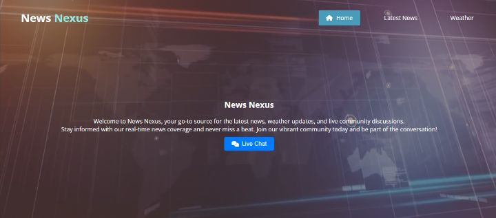
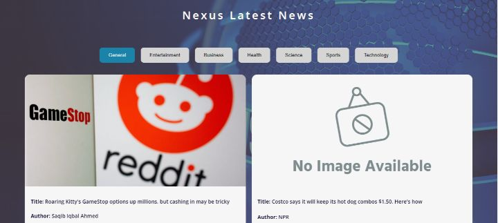
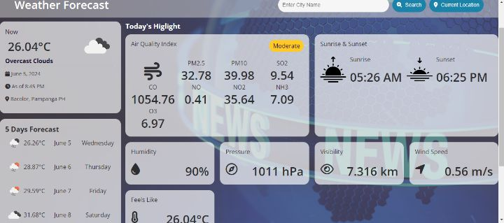
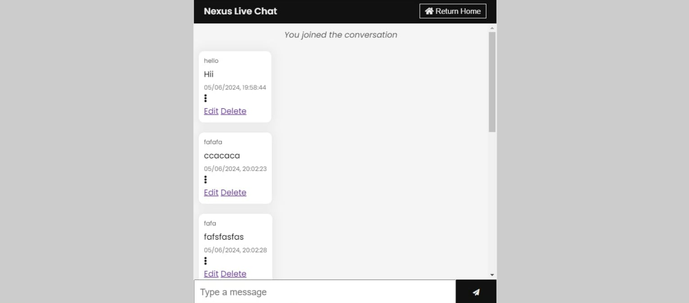

# News-Nexus
Dynamic Website: News, Weather Forecast, and Live Chat

## Overview
This project is a dynamic single-page website that provides up-to-date news, weather forecasts, and a live chat feature. It is built using JavaScript for dynamic content updates, integrates multiple web APIs, and uses WebSockets for real-time communication.

## Features
### News
- *API Integration*: Fetches the latest news articles using the News API.
- *Dynamic Display*: Displays news articles dynamically on the web page.
- *Error Handling*: Manages API request failures gracefully.

### Weather Forecast
- *API Integration*: Retrieves weather data using the Weather API.
- *Dynamic Display*: Shows current weather conditions and forecasts.
- *Error Handling*: Handles errors in fetching weather data and notifies the user.

### Live Chat
- *WebSocket Integration*: Enables real-time chat functionality using WebSockets.
- *Real-Time Updates*: Updates chat messages in real-time without needing to refresh the page.
- *User Notifications*: Notifies users of new messages and connection status.

## Technology Stack
- *JavaScript*: For DOM manipulation and dynamic content updates.
- *Fetch API / Axios*: For fetching data from the News API and Weather API.
- *WebSockets*: For real-time chat functionality.

## Setup Instructions

### Prerequisites
- Node.js and npm installed on your local machine.

### Installation
1. Clone the repository:
 git clone https://github.com/CPE-MB/News-Nexus.git
2. Navigate to the project directory:
   
   cd News-Nexus
   
3. Install the dependencies:
   
   npm install
   
## Usage

### News
- The latest news articles will be fetched and displayed on the main page.
- Click on an article title to read the full article.
- users can select headlines base on the categories provided 

### Weather Forecast
- Enter a city name in the search bar to get the current weather and forecast.
- The weather data will be displayed dynamically on the page.
- Button on for Automatic Current Location

### Live Chat
- Enter your username to join the chat.
- Send messages and see real-time updates from other users.

## Usage of US API Servers
Due to technical constraints, we are using US-based API servers for fetching news and weather data. These APIs provide the most reliable and comprehensive data, ensuring the best user experience. We encountered limitations with accessing equivalent services from Philippine servers, prompting this choice. We apologize for any inconvenience and appreciate your understanding.

## Known Issues
- **Fetch Update Interval**: The fetch for news and weather updates only every 2 hours. We are working on optimizing this interval to provide more frequent updates. Thank you for your patience.
## Contributing
We welcome contributions! Please open an issue or submit a pull request for any improvements or bug fixes.

## License
This project is licensed under the MIT License.

## Contact
For any questions or inquiries, please contact Dummyone1728@gmail.com .
